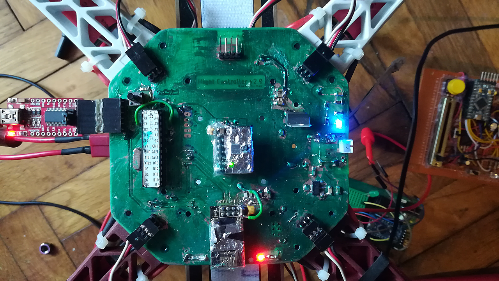
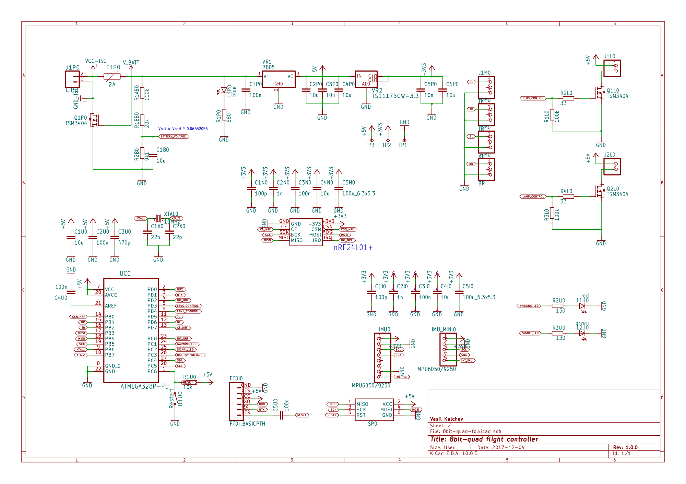
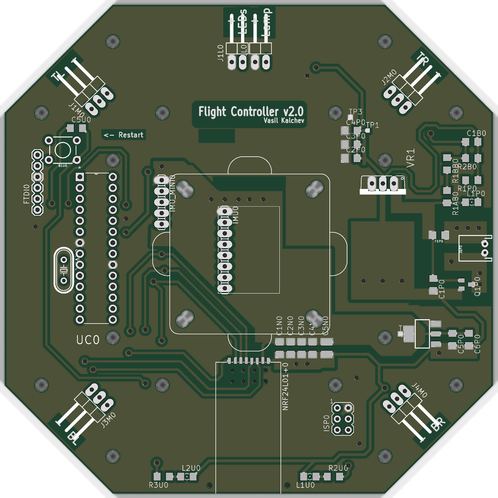
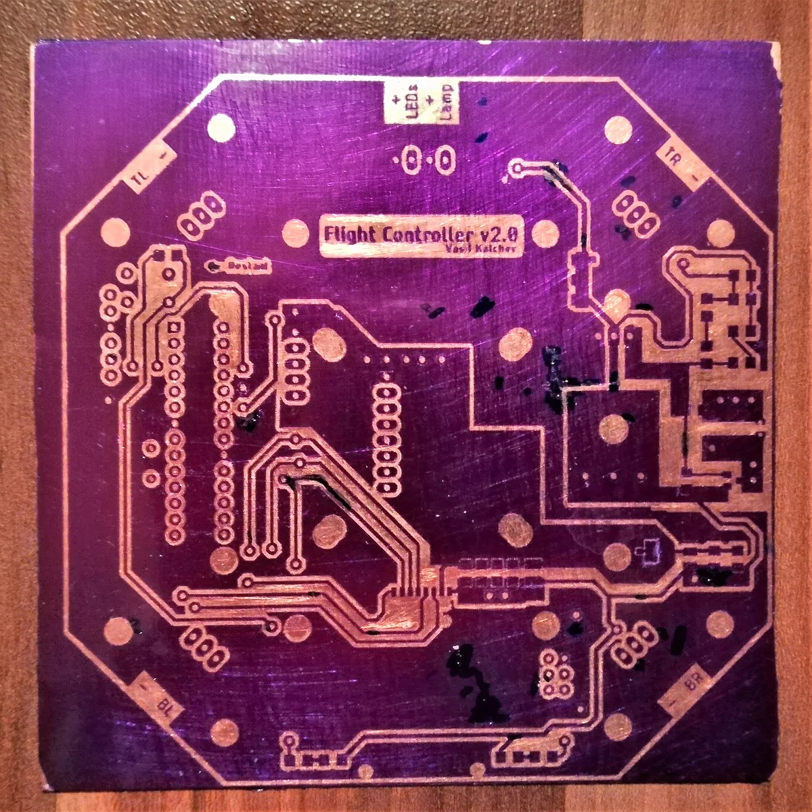
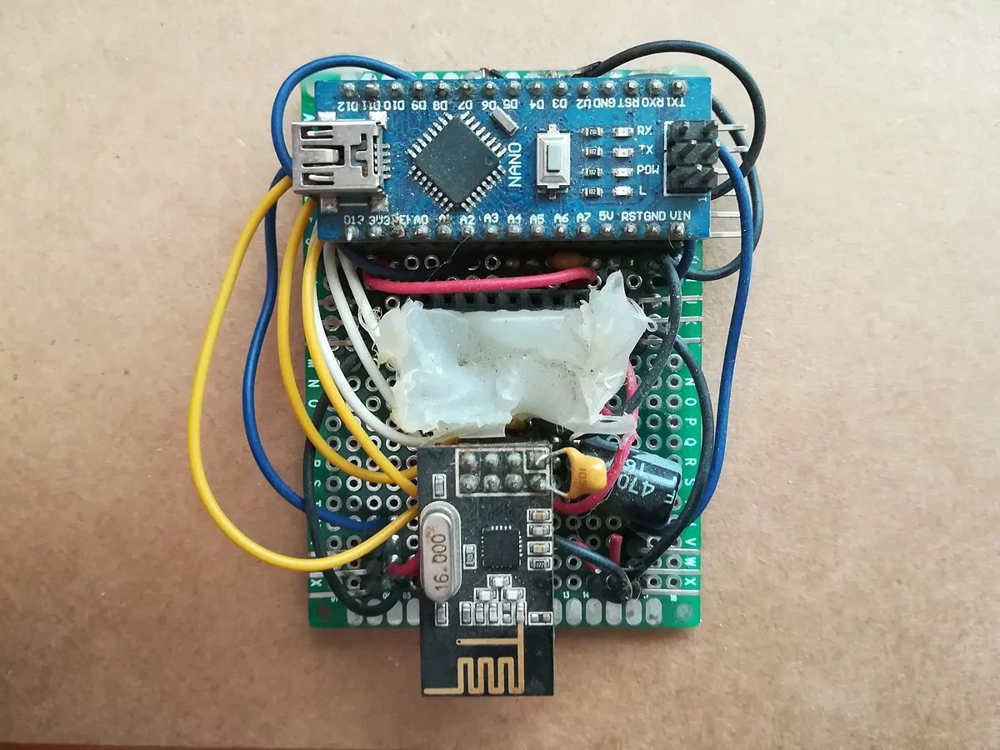

# 8bit-quad

Flight controller **PCB** for a custom-built quadcopter based on the ATmega328
microcontroller. An IMU, an nRF24L01+ radio and four ESC outputs on a 113 mm
octagon shaped to the top plate of an F450 frame.

It was etched at home, populated, flown, and retired. This repository is an
archive of it, not a design anyone is expected to build. [The firmware that
ran on it](https://github.com/VasilKalchev/8bit-quad) is in its own
repository.



<sub>The board on the frame with an FTDI adapter attached. The remote is on
the right, on protoboard. It never had a PCB; what it had to provide is in
<a href="rc/">rc/</a>.</sub>

<table>
<tr>
<td width="50%"><a href="fc/_export/sch.pdf"></a></td>
<td width="50%"></td>
</tr>
<tr>
<td align="center"><sub>schematic, click for the PDF</sub></td>
<td align="center"><sub>board</sub></td>
</tr>
</table>

```
fc/          KiCad 10 project, symbols and footprints included
  _export/   schematic and board images
  bom.txt    62 components
rc/          what the remote had to provide
gallery/     photographs
```

Everything the project needs is inside it. There are no dependencies on
installed libraries.

## The board

**The outline** is a 113 mm octagon because the board was originally meant to
*be* the F450's top plate rather than sit on it. A load-bearing flight
controller: the arms bolt through it, every landing is absorbed by the PCB,
the frame's vibration is piped straight into the IMU with nothing in between,
and any crash that would have cracked a plate worth a couple of euros instead
cracks the one part carrying all the electronics. Obvious in hindsight. Also
in foresight, to be fair.

The shape stayed regardless, and the board ended up bolted above the plate
like every other flight controller ever made.

Pin names below are the ones the firmware uses.

**The microcontroller** is an ATmega328P-PU in a DIP-28 socket with a 16 MHz
crystal, programmed over either an AVR ISP header or an FTDI header, with a
restart button next to it.

**The IMU** is an MPU6050 or MPU9250 breakout on I2C. There are two header
footprints for it, 1x8 and 1x5, so either of the two common module shapes
fits. Its interrupt lands on `PD2`. The outline drawn around it is an
anti-vibration plate, drawn when it was still meant to carry the IMU module
and nothing else. It ended up carrying the whole flight controller. So the
vibration problem was understood, and then solved by moving it one level up.

**The radio** is an nRF24L01+ PA/LNA module on hardware SPI, with `CE` on
`PD7`, `CSN` on `PB0` and the interrupt on `PC0`. The firmware's last revision
abandoned it for a PPM receiver, which takes over `PD2`.

**The ESC outputs** are four 3-pin headers labelled by frame position: `TL` on
`PD5`, `TR` on `PB2`, `BL` on `PD6`, `BR` on `PB1`. All four are hardware PWM
outputs, two on timer 0 and two on timer 1. Freeing timer 0 for that is why
the firmware ships its own Arduino core, which moves `millis()` onto timer 2.

**Power** arrived on a JST connector behind a 2 A PPTC and a MOSFET for
reverse polarity, then a 7805 and a TS1117 gave 5 V and 3.3 V. Battery voltage
reached `PC3` through 110k and 20k over 9k1, which the schematic notes as
`Vout = Vbatt * 0.06542056`.

**Indication** is a signal LED on `PC2` and a warning LED on `PC1`, plus two
low side MOSFETs switching an arm-LED header on `PD3` and a lamp header on
`PD4`.

Two measurements from a PicoScope in March 2022, on the built board: the ESC
drive edges rose in 11.2 ns at 5.065 V, and the IMU's I2C lines in 125 ns at
3.542 V.

## Etched at home

There are no gerbers and never were. The copper layers were printed onto
transparency and the board was etched by photoresist, so its rules are
generous: 18 mil clearance, 16 mil minimum track, 0.8 mm minimum drill. There
is [a video of the etching](https://youtu.be/nzKjSb2GAe4).



<sub>Etched, still purple from the photoresist, before drilling. The clearest
record of the artwork that exists.</sub>

> [!NOTE]
> DRC reports three errors, all on `J1P0`, the JST battery connector, whose
> pads and holes break the board's own rules. That is inherent to the
> footprint and predates the KiCad conversion; the board was built and flown
> that way. The rest is cosmetic silkscreen and thermal relief warnings.
> Connectivity is clean, with zero unconnected items once the zones are
> filled.

## History

This board is v2. The first flight controller was an Arduino Nano and an
nRF24L01+ hand wired on protoboard, and it is the reason this one is lettered
`Flight Controller v2.0`.



<sub>v1, the protoboard flight controller this board replaced. Its IMU
module is missing here.</sub>

It was drawn in Eagle. Autodesk stopped developing standalone Eagle in 2024
and folded it into Fusion, so the design was converted to KiCad in 2026. The
original Eagle files are in the first commit of this repository and nowhere
else.

## Licence

Copyright Vasil Kalchev 2017

Licensed under CERN-OHL-P v2 or later. You may redistribute and modify this
source and make products using it under the terms of the
[CERN-OHL-P v2](https://ohwr.org/cern_ohl_p_v2.txt). This source is
distributed WITHOUT ANY EXPRESS OR IMPLIED WARRANTY, INCLUDING OF
MERCHANTABILITY, SATISFACTORY QUALITY AND FITNESS FOR A PARTICULAR PURPOSE.
Please see the CERN-OHL-P v2 for applicable conditions.
